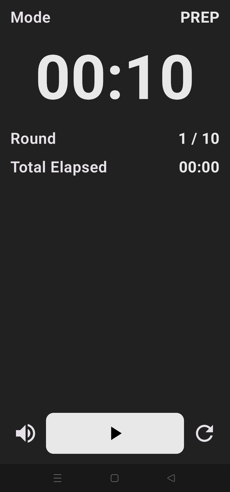

# HIIT Workout Timer

This app is created to allow users to set timers for HIIT (High-Intensity Interval Training).

You set the timer for prep before starting the workout and then the number of minutes/seconds you want to work and rest for as well as the total number of training rounds.

Starting workout takes you to the next page where you see if you are in prep/work/rest mode and how much time you have spent working out.

## Sample images

#### Landing and prep pages

  
  

#### Work and rest pages

  
  

*disclaimer: this app was only created as a fun side-project for me to explore app development while making something I can use in my everyday life* 
